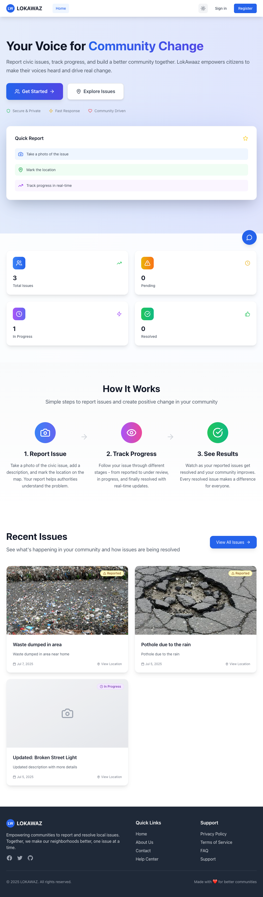
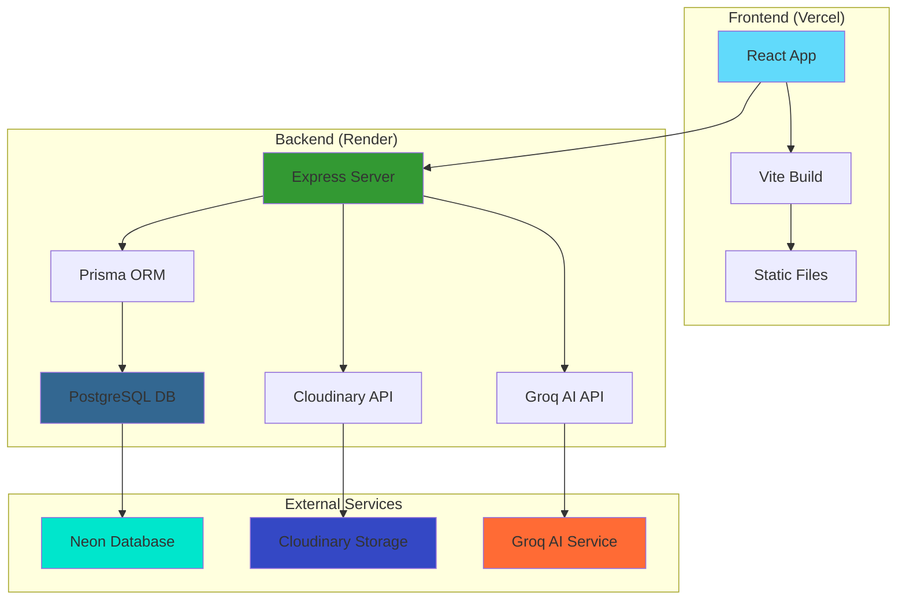

# 🏙️ LOKAWAZ - Community Issue Reporting Platform

<div align="center">
  
  
  
  [](https://lokawazweb-ab4hifzha-aryan-duttas-projects.vercel.app)
  [](https://lokawazv1.onrender.com/api)
  [](LICENSE)
  
  **Empowering Communities to Report and Track Civic Issues**
  
  [🎯 Features](#-features) • [🚀 Quick Start](#-quick-start) • [📖 Documentation](#-api-documentation) • [🤝 Contributing](#-contributing)

</div>

---

## 📋 Table of Contents

- [🌟 Overview](#-overview)
- [✨ Features](#-features)
- [🛠️ Tech Stack](#️-tech-stack)
- [🏗️ Architecture](#️-architecture)
- [🚀 Quick Start](#-quick-start)
- [📱 Usage](#-usage)
- [📖 API Documentation](#-api-documentation)
- [🌐 Deployment](#-deployment)
- [🧪 Testing](#-testing)
- [🤝 Contributing](#-contributing)
- [📜 License](#-license)

---

## 🌟 Overview

**LOKAWAZ** is a modern, full-stack web application designed to bridge the gap between citizens and local authorities. It enables community members to report civic issues like potholes, street lights, waste management problems, and infrastructure concerns with precise location data and visual evidence.

### 🎯 Mission
To create a transparent, efficient, and user-friendly platform that empowers citizens to actively participate in improving their communities while providing authorities with organized, actionable data.

---

## ✨ Features

### 👥 **User Management**
- 🔐 **Secure Authentication** - JWT-based login/registration system
- 👤 **User Profiles** - Personal dashboards and issue tracking
- 🛡️ **Role-based Access** - Admin and User roles with different permissions

### 📍 **Issue Reporting**
- 🗺️ **Interactive Maps** - Leaflet-powered location selection
- 📸 **Multi-image Upload** - Cloudinary integration for visual evidence
- 📂 **Categorization** - Organized issue types and priority levels
- 📱 **Responsive Design** - Mobile-first approach for field reporting

### 🤖 **AI-Powered Assistance**
- 💬 **Smart Chatbot** - Groq AI integration for user guidance
- 🎯 **Issue Classification** - Automated categorization suggestions
- 📝 **Smart Descriptions** - AI-assisted issue description enhancement

### 📊 **Analytics & Management**
- 📈 **Dashboard Analytics** - Real-time statistics and trends
- 🔍 **Advanced Filtering** - Search by location, category, status
- 📋 **Admin Panel** - Comprehensive issue management system
- 📊 **Progress Tracking** - Status updates and resolution monitoring

### 🎨 **User Experience**
- 🌓 **Dark/Light Mode** - Customizable theme preferences
- ⚡ **Fast Performance** - Optimized loading and smooth interactions
- 🔔 **Toast Notifications** - Real-time feedback system
- 📱 **PWA Ready** - Progressive web app capabilities

---

## � Screenshots

<div align="center">

### 🏠 **Home Page**

*Clean, intuitive interface with interactive map and issue overview*

### 📋 **User Dashboard & AI Chatbot**

*Personalized dashboard with issue tracking and AI-powered assistance*

### 📝 **Issue Reporting**

*Streamlined issue reporting with location selection and image upload*

### 👨‍💼 **Admin Dashboard**


*Comprehensive admin panel with analytics and issue management*

</div>

---

## �🛠️ Tech Stack

<div align="center">

### **Frontend**


### **Backend**


### **Cloud Services**


### **AI & Tools**


</div>

---

## 🏗️ Architecture



---

## 🚀 Quick Start

### Prerequisites
- **Node.js** (v18+)
- **npm** (v8+)
- **PostgreSQL** database
- **Cloudinary** account
- **Groq API** key

### 1️⃣ Clone Repository
```bash
git clone https://github.com/aRyanDuTta425/LOKAWAZV1.git
cd LOKAWAZV1
```

### 2️⃣ Backend Setup
```bash
# Navigate to server directory
cd server

# Install dependencies
npm install

# Setup environment variables
cp .env.example .env
# Edit .env with your configurations

# Setup database
npm run db:generate
npm run db:migrate
npm run db:seed

# Start development server
npm run dev
```

### 3️⃣ Frontend Setup
```bash
# Return to root directory
cd ..

# Install dependencies
npm install

# Setup environment variables
echo "VITE_API_BASE_URL=http://localhost:8000/api" > .env

# Start development server
npm run dev
```

### 4️⃣ Access Application
- **Frontend**: http://localhost:5173
- **Backend API**: http://localhost:8000/api
- **Database Studio**: `npm run db:studio` (in server directory)

---

## 📱 Usage

### 🔐 **Getting Started**
1. **Register** a new account or **Login** with existing credentials
2. **Complete** your profile setup
3. **Explore** the interactive map and existing issues

### 📍 **Reporting Issues**
1. Click **"Report New Issue"** button
2. **Select location** on the interactive map
3. **Add photos** and detailed description
4. **Choose category** and priority level
5. **Submit** for review

### 🤖 **Using AI Assistant**
1. Click the **chatbot icon** in the bottom-right
2. **Ask questions** about the platform
3. **Get help** with issue reporting
4. **Receive suggestions** for better descriptions

### 📊 **Dashboard Features**
- **View your submitted issues**
- **Track resolution progress**
- **Access analytics and insights**
- **Manage account settings**

---

## 📖 API Documentation

### 🔗 **Base URL**
```
Production: https://lokawazv1.onrender.com/api
Development: http://localhost:8000/api
```

### 🔑 **Authentication Endpoints**
```http
POST /auth/register     # User registration
POST /auth/login        # User login
GET  /auth/profile      # Get user profile
PUT  /auth/profile      # Update user profile
```

### 📋 **Issue Management**
```http
GET    /issues          # Get all issues (with filters)
POST   /issues          # Create new issue
GET    /issues/:id      # Get specific issue
PUT    /issues/:id      # Update issue (admin only)
DELETE /issues/:id      # Delete issue (admin only)
```

### 🤖 **Chatbot Integration**
```http
POST /chatbot/message   # Send message to AI chatbot
GET  /chatbot/history   # Get chat history
```

### 👥 **Admin Endpoints**
```http
GET /admin/users        # Get all users
GET /admin/statistics   # Get platform analytics
PUT /admin/issues/:id   # Update issue status
```

### 📸 **File Upload**
```http
POST /upload/image      # Upload issue images
```

---

## 🌐 Deployment

### 🚀 **Live Deployment**
- **Frontend**: [lokawazweb-ab4hifzha-aryan-duttas-projects.vercel.app](https://lokawazweb-ab4hifzha-aryan-duttas-projects.vercel.app)
- **Backend**: [lokawazv1.onrender.com](https://lokawazv1.onrender.com/api)

### 📦 **Deployment Steps**

#### **Frontend (Vercel)**
```bash
# Install Vercel CLI
npm i -g vercel

# Deploy to production
vercel --prod
```

#### **Backend (Render)**
1. Connect GitHub repository to Render
2. Configure environment variables
3. Deploy with automatic builds

#### **Database (Neon)**
1. Create Neon database instance
2. Configure connection string
3. Run migrations in production

---

## 🧪 Testing

### 🔬 **Backend Testing**
```bash
cd server

# Run all tests
npm test

# Run tests in watch mode
npm run test:watch

# Run specific test file
npm test auth.test.js
```

### 🎯 **Frontend Testing**
```bash
# Run component tests
npm run test

# Run E2E tests
npm run test:e2e
```

### 📊 **Testing Coverage**
- **Authentication**: Login, Registration, JWT validation
- **Issue Management**: CRUD operations, validation
- **File Upload**: Image processing, Cloudinary integration
- **API Security**: Rate limiting, input validation

---

## 🤝 Contributing

We welcome contributions from the community! Here's how you can help:

### 🛠️ **Development Process**
1. **Fork** the repository
2. **Create** a feature branch (`git checkout -b feature/amazing-feature`)
3. **Commit** your changes (`git commit -m 'Add amazing feature'`)
4. **Push** to the branch (`git push origin feature/amazing-feature`)
5. **Open** a Pull Request

### 📝 **Contribution Guidelines**
- Follow **ESLint** configuration
- Write **meaningful commit messages**
- Add **tests** for new features
- Update **documentation** as needed
- Ensure **responsive design**

### 🐛 **Reporting Issues**
- Use **GitHub Issues** for bug reports
- Provide **detailed reproduction steps**
- Include **screenshots** if applicable
- Tag with appropriate **labels**

---

## 🏆 **Contributors**

<div align="center">

[](https://github.com/aRyanDuTta425/LOKAWAZV1/graphs/contributors)

</div>

---

## 📜 License

This project is licensed under the **MIT License** - see the [LICENSE](LICENSE) file for details.

---

## 🙏 Acknowledgments

- **Leaflet** for interactive mapping capabilities
- **Tailwind CSS** for utility-first styling
- **Groq** for AI chatbot integration
- **Cloudinary** for image management
- **Prisma** for database management
- **Community** for feedback and contributions

---

<div align="center">

### 💼 **Professional Portfolio**

**Built with ❤️ by [Aryan Dutta](https://github.com/aRyanDuTta425)**

[](https://github.com/aRyanDuTta425)
[](www.linkedin.com/in/aryan-dutta-ad425)
 

---

**⭐ Star this repository if you found it helpful!**

</div>
